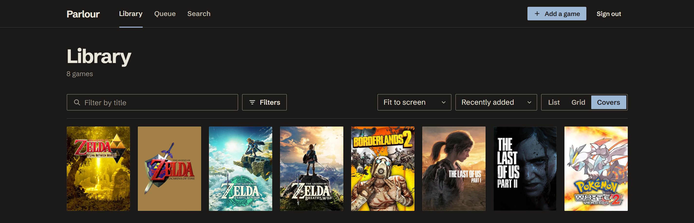
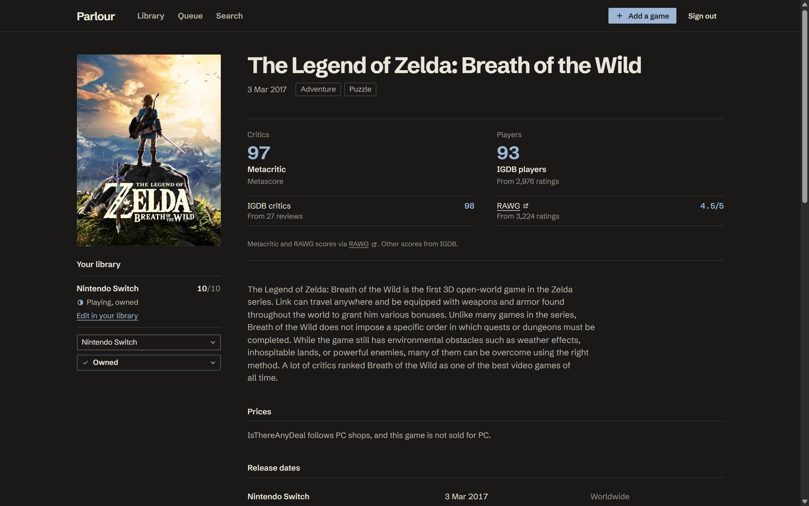
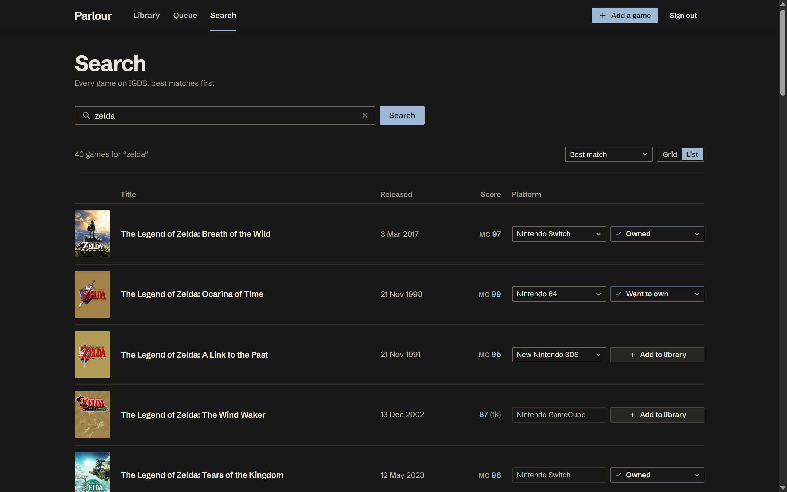
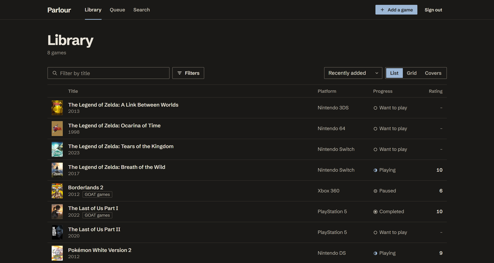
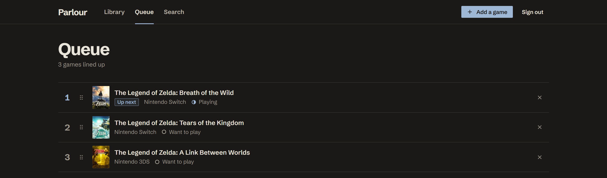
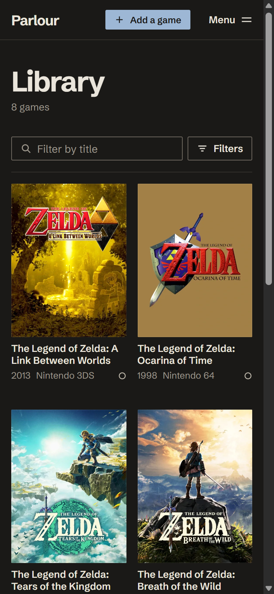
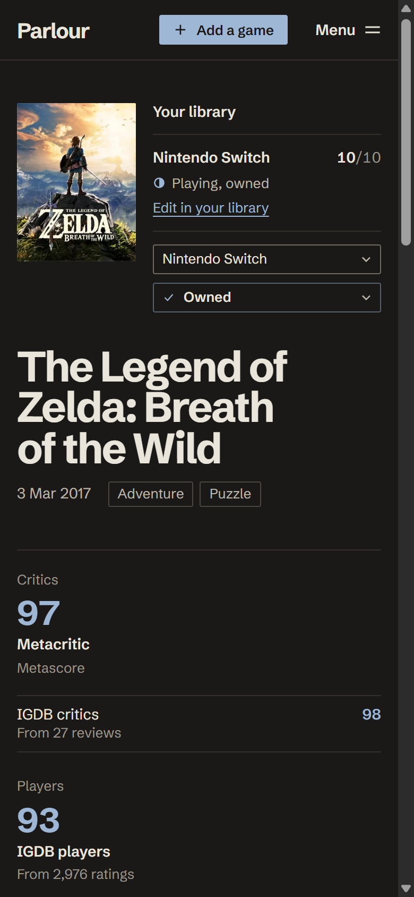

# Parlour

A catalogue of the games I own, have played and want to play next.

Live at [parlour-rose.vercel.app](https://parlour-rose.vercel.app). Search and game pages are open to anyone; libraries are invite-only.

Parlour keeps one record per game per platform: what you own, how far you got, what you thought of it, and what you want to play next. Game data comes from IGDB, scores from Metacritic (via RAWG) and IGDB, and prices by region from IsThereAnyDeal.



## What it does

- **Library.** List, grid and covers layouts. Filter by progress, ownership, platform, tag or title. Sort by title, platform (grouped under headings), progress, rating or date added. Your choice of layout and sort is remembered.
- **Editing in place.** A game opens in a box over the library: ownership, progress, dates, rating, tags and notes. Every change saves as you make it and shows at once.
- **Search and add.** Search all of IGDB, pick the platform, add a game in one press.
- **Game pages.** Scores from the most credible sources first, the release date on each platform, screenshots and trailers, and current and historical prices in your region.
- **Play queue.** Line games up and drag them into order. Finishing a game takes it off the queue.

|                                                                                         |                                                                          |
| --------------------------------------------------------------------------------------- | ------------------------------------------------------------------------ |
|  |  |
|                              |                             |

<p>
  
  
</p>

## How it is built

- **Next.js** (App Router, server components and server actions) and **React**, in strict TypeScript.
- **Supabase** for Postgres and sign-in. Row-level security on every personal table, so the database itself decides what each account sees.
- **CSS Modules** over a small token system: one typeface (Schibsted Grotesk), one accent colour, square edges, no shadows or gradients.
- **Motion** for transitions. Every state change animates, presses respond on pointer-down, your own changes show before the server confirms them, and only transform and opacity animate. With reduced motion turned on, things crossfade instead of moving.
- **dnd-kit** for the queue, with keyboard and screen reader support.
- External APIs are called only from the server, cached in Postgres, and served stale if the source is down.

[DECISIONS.md](DECISIONS.md) records why things are the way they are. [PROGRESS.md](PROGRESS.md) tracks the build stage by stage.

## Running locally

Requires Node 22.12 or later.

```bash
npm install
npm run dev
```

Then open http://localhost:3000.

## Configuration

Copy `.env.example` to `.env.local` and fill it in; each value says where it comes from. The Supabase URL and publishable key are safe to expose, because the database only returns what row-level security allows. Everything else is server-only.

## Checks

```bash
npm test            # unit and component tests, offline
npm run lint
npm run typecheck
npm run build
```

## Database

The schema lives in `supabase/migrations`, one SQL file per change, named by the version the database recorded when it was applied. The files are the source of truth; nothing is changed in the dashboard.

- **Access rules** are tested in `supabase/tests/database`. With Docker, `npx supabase test db` runs them against a local copy. Without it, paste the file into the SQL editor of any Supabase project: it runs inside a transaction that rolls back, and prints only a failure summary if something breaks.
- **Types** in `src/lib/supabase/database.types.ts` are generated from the live schema. Regenerate them after every migration (`npx supabase gen types typescript --project-id <ref>`).

### Sign-in settings

Sign-in is by emailed link, and accounts are invite-only. These are set in the Supabase dashboard, under Authentication:

1. **Sign In / Providers**: turn off "Allow new users to sign up".
2. **URL Configuration**: add `http://localhost:3000/**` (and the production URL, once deployed) to the redirect URLs.
3. **Users**: create each account with "Add user". There is no public sign-up.

Until a custom email service (SMTP) is configured, Supabase only sends sign-in emails to members of the project's team, a few per hour, and the email template cannot be edited. Links then work only in the browser that asked for them. Before Parlour is public, set up custom SMTP and change the Magic Link template to link to `{{ .SiteURL }}/auth/confirm?token_hash={{ .TokenHash }}&type=email`, which makes links work on any device.

## Game data (IGDB)

Game data comes from IGDB through a server-side client in `src/server/igdb`. It needs a Twitch app (see `.env.example`), and the Supabase secret key to write the shared catalogue.

- One IGDB token is shared by the whole app and stored in `provider_tokens`. Twitch disables the oldest tokens once an app has 25, so a token per request or per server would eventually break.
- Requests stay under IGDB's limits (4 per second, 8 at once) and back off on 429s.
- Everything fetched is cached in Postgres: searches for a day, games for a week.

`npm test` runs offline against saved IGDB responses in `src/server/igdb/fixtures`. `npm run test:live` runs the end-to-end check against the real IGDB and Supabase using `.env.local`.
